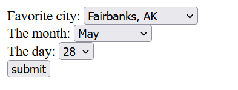
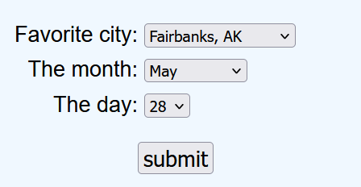

# Django Notes

## Intro

Django is a fine-grained tool, allowing developers to control almost every aspect of the web-site they are developing. The down side of this control is that the learning curve can be significant.

A brief overview of how the Django pieces fit together follow.

### Processing Basics
When a user visits a website such as example.com, Django starts the processing at the outer urls.py and tries to match the path "" and, if it finds a match, it does as defined there. That match typically passes processing to myapp/urls.py and tries to match a path there. If it matches a path, it typically will refer to a function defined in views.py. 

That function will do any necessary processing and then call for an html page to be displayed. For the initial or root page, such as example.com/, the page that is called is index.html. The processing performed by the called function can be simple or extensive and the html page that is called can be simple or complex. Combined, the function in views.py is the controller and the html page is the view of the MVC triad.

The html pages are typically kept in the templates folder for the app (not the outer folder). For namespacing purposes, a folder under the templates folder is named for the app. For exampled, if the app is named "fergus", it will hold a templates folder which in turn has a folder named ferus. In otherwords, /myproject/fergus/template/fergus. When an html page (template) is called, it is called as fergus/<page.html> that is found inside the template folder.

## Django Templates

The html pages are referred to templates for two reasons: 

*   they can be assembled out of "building blocks" 
*   they can process commands and variables. 

### Templates as Building blocks

A common convention is that a "base" html page is created that holds the elements that will appear in every html page in the app, such as style sheets, headers, navigation bars, or page layouts. This base page is then incorporated into the other html pages of thse app by using the  command. 

Being able to just bring in large portions of boilerplate reduces the amount of work required of developers and reduces the number of errors. It also ensures that the latest version of changes are incorporated into all of the pages.

The base pages can contain named blocks, such as   . The pages that extend the base pages can just add the material that belongs inside the named blocks, again reducing the amount of work required of the developers.

### Variables and Commands

The function that calls an html page can insert variables into the "context" that is passed to the page that is rendered by the function. These variables from its context can then be displayed in the html page. For example, the function in views.py could calculate the sales tax on a purchase and the pass the purchase total and sales tax into the html page. The html page would then display these passed in amounts using the {{ purchase_total }} and {{ sales_tax }}. 

Note that variables are surrounded by double curly-braces. The variable name is, by convention, separated from the double curly-braces by a space.

The context can be populated as a dictionary as shown below:

---
    context = {'id': id, 
               'location': location,
               'loc':loc,
               . . . 
               . . . 
               'date': date,
               'type':'Daily Avgs'}
---

The context is then included when the page is rendered as follows:

---
    return render(request, "avgs/display_daily.html", context)
---

Django provides three commands for templates: the if command, the with command, and the for command. Commands are surrounded by  markers and delimited with begin and end statements. An example of the if and with commands follow:

---
    
        
        <my html here>
        
    
        
        <my html here>
        
    
---

The first line is the 'if' portion where the test is performed. Midway in the code block is the else statement that divides the actions that will be performed when the if statement is true from the actions that are performed if the if statement is not true. In this example, age is a variable that was passed in. The 'with' portion is used to redefine a complex item as something simpler. The 'with' - 'endwith' define the scope of the with.

The 'for loop' command is typically used with variable length lists on the html page. An example is shown below:

---
    <ul>
     
        <li>{{ athlete.name }}</li> 
     
    </ul> 
---

In this example, the athlete_list is passed into the html page and then looped thru, with each item in the athlete_list displayed as list items inside the unordered list markers.

Even though the if command and for-loop command are performing some processing, they are doing this only to support the proper display of information and therefore do not violate the basics of MVC separation of responsibilities. If the views.py functions were responsible for the correct display of information, it would violate the MVC principles.

## Models

Django provides robust support for database models, allowing users to build almost any relational database that could be needed for almost every situation. This section will not repeat the detailed and extensive documentation that is available on-line. Instead, it will focus on some of the conceptual basics.

First, Django expects to manage all of the database creation and maintenance within its models.py file. This is contrary to the more mainstream separation of the database tool and the programming tool(s). The advantage of this approach is that all of the database info is in one place; there is no need to become both a database expert AND a programming expert. It's all in Django models.

This approach results in the need for database update tools which Django provides as the `makemigrations` & `migrate` tools. `Makemigrations` identifies the changes that need to be made and produces a SQL file that describes those changes in standard SQL statements in the appropriate idioms of your chosen database tool (MySQL, PostgreSQL, etc). `Migrate` actually applies those changes to your database.

The basic procedure is as follows:

1.  Update the models.py file with your database changes.
1.  Run `makemigrations` on the app where your models.py file is located. For example, `python manage.py makemigrations <app name>`
1.  Run `python manage.py migrate` to apply those changes.

Note that `migrate` will pick up all of the migration sql files that exist and try to apply them in the proper order. The migration sql files will declare any dependencies and try to prevent us from applying migrations that will break our database.

In a multi-developer environment, database changes will be propagated between developers through the repository. If you have made changes to your models.py file, you should commit those changes and push them to the repository. 

The other developers will receive those changes the next time they `pull` from the repository. The other developers, on receiving an updated models.py file, will then perform a `makemigrations` and then `migrate` their databases.

Once the system is uploaded on the remote server, it will require the admin to run `makemigrations` and `migrate` on the server. Hopefully that will be a rare event because most of the development work will have been completed by the time it is moved onto the remote server.

## Forms

Django forms are directly associated with HTML forms that are used for data submittal. I foolishly had assumed that they would be more helpful in generating the complete web page but they do not; they are strictly related to the display of the fields that the user must interact with and the submittal of that data.

Forms in Django are similar to models in Django in that each type of field is just listed as belonging to a class. For example, in models.py you might enter

---
    class Station(models.Model):
        station_name = models.CharField(max_length=32)
        location = models.CharField(max_length=48)
        main_activity = models.CharField(max_length=200)
---

While in forms.py, you might enter

---
    class ClientForm(forms.Form):
        fname = forms.CharField(max_length=30)
        lname = forms.CharField(max_length=40)
        street_addr = forms.CharField(max_length=100) 
---

Conceptually, they are very similar and differ mostly in the classes that they extend (models.Model vs forms.Form). We will probably be working closely with databases in which case the classes will be extending ModelForm. Refer to the extensive documentation on-line for details of setting up forms for databases.

The biggest stumbling block for me was understanding how forms were put into use and what information was provided to the called action page. 

### Putting Forms to Work

Once you have a form that lists the fields that you want displayed, you need to pass that form to the html page that will display. That is done in the views.py file in the appropriate function. A simplified description of the process follows:

1.  The user enters an address that is processed by the project (outer) urls.py 
1.  The project urls.py passes processing to the correct app's urls.py
1.  That urls.py finds the path that matches the address and calls the appropriate function in views.py
1.  Somewhere inside that function, an instance of the desired form is created, such as `form = ExampleForm()`. Be sure to import that form or it won't be recognized, such as `from .forms import ExampleForm`. 
1.  Perform any processing in the function and then include it as part of the return statement, similar to:

---
    return render(request, "<app name>/<pageToDisplay.html>", {"form": form})
---
Two things to note in this example: the html page to display will be in the templates/app name folder and that the form is passed as a dictionary inside curly-braces.

On the page that will display your form, you must write the necessary html form elements. For example:

---
    <form method="post" action="">
      
      {{ form }}
      <input type="submit" value="submit">
    </form>
---

Items to note about this example:

*   The method is post. It is recommended that post is used because it is more secure and cleaner.
*   The action is a Django command that translates roughly into: look in urls.py and find a matching path for 'daily'. In this case, daily is a function in views.py that performs processing base on user inputs and then calls another html page to display the results of the processing. 
*   The csrf_token command generates a unique token to help prevent "cross-site request forgeries". This csrf_token should be included with every one of your forms as part of your security best practices. The csrf_token is super-long and, if you use a get (instead of a post), it appears at the beginning of the address line which is super-ugly.
*   The form that you passed in the function as {'form':form} can then be displayed using double curly-braces as {{ form }}. The fields that you defined in your form will then appear on the html page.
*   The input type of submit generates a std html button that displayed for the user to press.
*   When the user presses the submit button, the fields on your form are included as part of the info that is sent to the page in the action defined in the beginning of the form.

**IMPORTANT:** The form can only have one action which means that it is difficult to have a page where a user makes a choice that sends the user to different pages depending on their choice. There are probably ways or added libraries to work around this limitation.

**IMPORTANT:** Django only wants to display one form per page. There are well-documented ways to work around this limitation.

*   The values that are passed to the called function can be retrieved using commands like:

---
    day = request.POST.get('the_day', 'Day Not Provided')
    month = request.POST.get('the_month', 'Month Not Provided')
---

*   Note that if the form method = 'get', the request command would be `day = request.GET.get(...)`
*   Also note the optional error messages of `. . . Not Provided`. These values are not required but are helpful in solving problems with data not displaying.
*   Also note that the names for the values that are passed come from the form. For example, the matching form includes:

---
    the_month = forms.ChoiceField(choices = MONTH_NBR)
    the_day = forms.ChoiceField(choices = DAY_NBR)
---

## Forms and Formatting with Stylesheets

Once the form is displayed on the html, it becomes obvious that the default appearance leaves a lot to be desired. The location of each field is determined by the length of the labels for that field. And there is no space between the fields.

Unfortunately, this is the default output of a form and because of the MVC priorities, the form and the views.function can't participate in the appearance on the html page. Which means that the your app must use the standard formatting technique of stylesheets.

The best place to put any references to your stylesheet is in your basic.html form that all of your pages will extend. 

The stylesheet(s) get their own folder tree inside your app, just like templates folder. And just like the templates that are kept in proj_name/app_name/templates/app_name, you local stylesheets belong in proj_name/app_name/static/app_name.

Your basic.html should contain inside the head  lines similar to the following:

---
        
    <link rel="stylesheet" href=>
---

The first line is a command to load any static files. This can appear anywhere in base.html but I like to put it in the head, just before I reference the stylesheet. You could have multiple stylesheets or scripts loaded at this point; it just depends on what additional items you want to include in your project.

In the following screenshot, the background color has been set to aliceblue, the labels have been assigned a std width and right-aligned. They also have a small 5px margin added to the top and bottom of the labels, which also affected the position of the fields.

