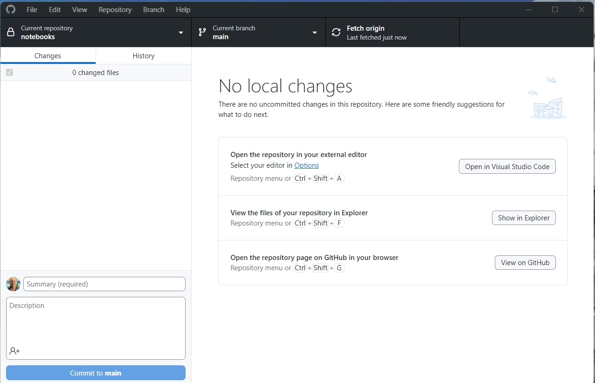
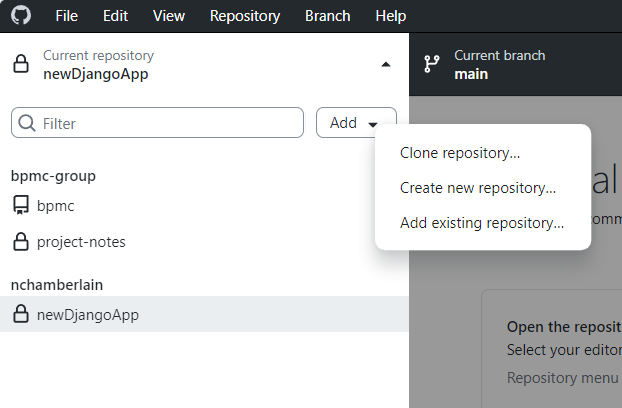
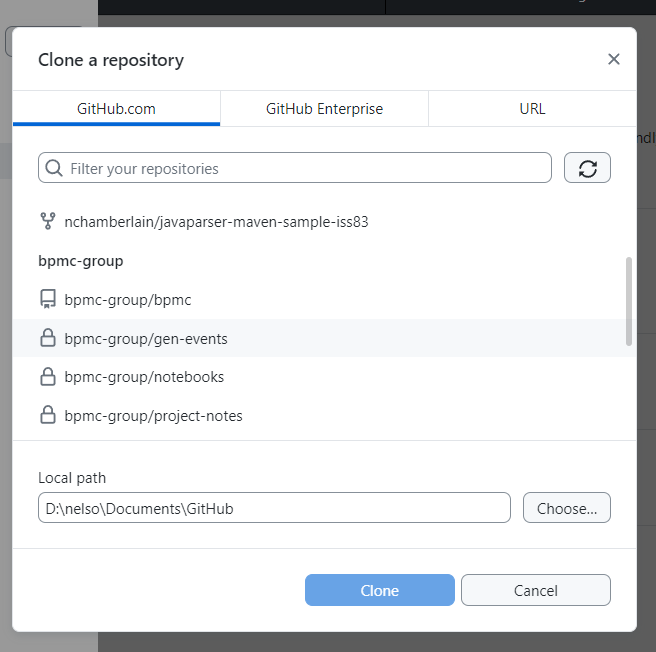
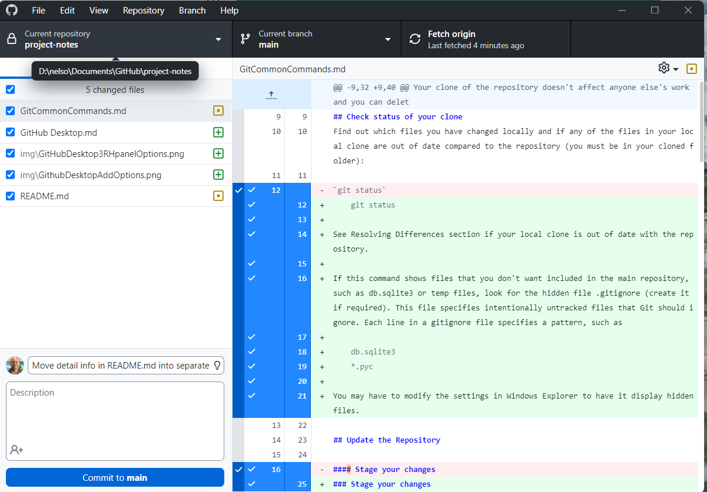
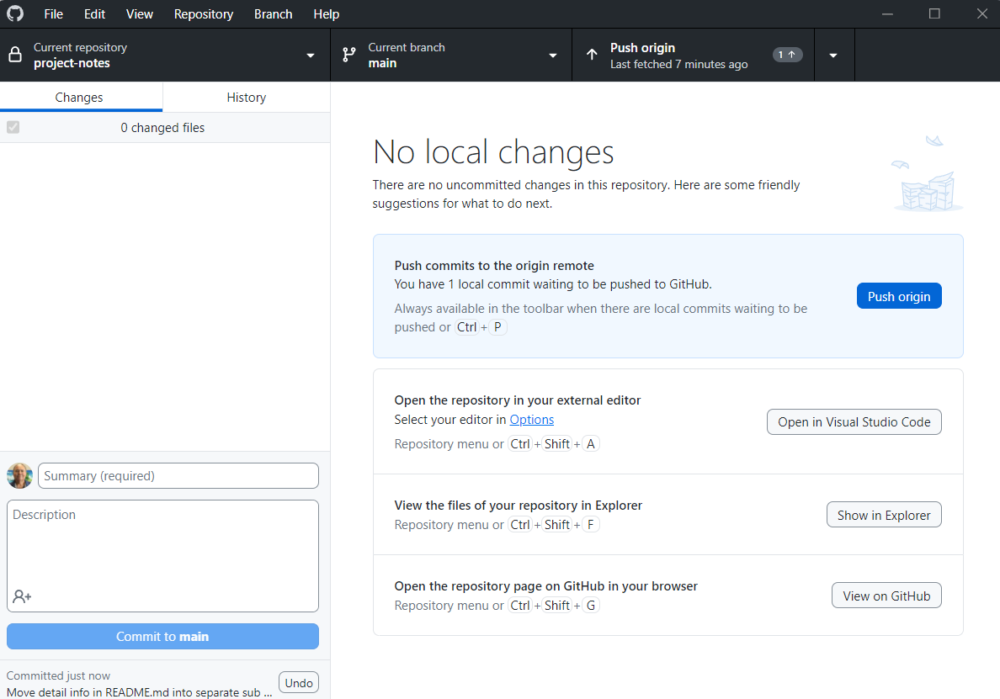

# GitHub Desktop

GitHub offers a free tool for Windows & Mac called GitHub Desktop that tries to make it easier to work with a GitHub repository. 

GitHub Desktop allows you to:

*   Create a new repository or clone an existing repository
*   View a list of files in the repository 
*   View the repository page on GitHub
*   Open files in the selected repository with your choice of editor, such as VS Code. With VS Code, the GitHub Desktop automatically opens a new instance of VS Code opened to the correct repository folder. 
*   Once you are inside VS Code you can use it as normal, including opening terminal windows and running the code.

In the upper left corner of the screen is Current Repository dropdown. You can select one or more repositories from this dropdown. Most of the time we will probably only the bpmc repo  selected, but GitHub Desktop makes working with multiple repos easier.

## Installing GitHub Desktop
Go to [Installing GitHub Desktop](https://docs.github.com/en/desktop/installing-and-authenticating-to-github-desktop/installing-github-desktop?platform=windows) for information about installing GitHub Desktop. You will use your GitHub username and authorization as part of the setup, as well as selecting your preferred editor.

## Selecting a Repository
To select a repo:

1.  Click on the "Current repository" dropdown triangle
1.  Click on the Add button 
1.  Click on "Clone repository..."
1.  A list of repositories associated with you is displayed, starting with the repos you own, followed by the repositories of the group(s) that you belong to.

2.  Verify (or update) the Local path where you want the clone installed
3.  Highlight the repo that you want to access
4.  Press the Clone button
1.  The repo will be cloned to the location that you selected.
1.  The first option in the right-hand panel is to open in your editor (selected when you installed GitHub Desktop). This will bring up VS Code with the cloned folder already selected as the Open Folder.
2.  At this point you can work with your editor like you always have except any changes that you made and saved will automatically be tracked by GitHub Desktop (no need to do `git status`).

## Updating the repository
When you are ready to commit some changes: 

1.  Save the files that you edited 
1.  Return to the GitHub Desktop app. 
1.  In the Changes tab (just below the Current repository dropdown), click on the file that you wish to view the differences 
1.  The changes are displayed in diff format, with plus and minus signs and colors highlighting your changes.
1.  If you are happy with the changes you made, commit them by filling in the Summary line (and larger description field if you think it is necessary) and then pressing the "Commit to **main**" button.
1.  Click on the "Push origin" button. If you don't push your changes, they are collected by GitHub Desktop and you will continue to see the highlighted message to push your commits until you push them. 
1.  Your changes are pushed to GitHub and can be shared by the group.

## Final Notes

GitHub Desktop makes it very convenient to perform the most common tasks. I had trouble getting used to selecting the Current repository but it's starting to feel more natural. It also offers all the features available in git & GitHub, such as branches, pull requests, etc.
