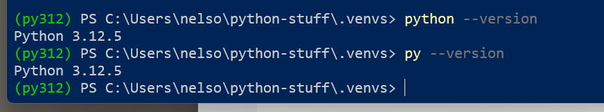

= Python Virtual Environments

Python includes the capability to create Virtual Environments (venv). This feature allows you to specify configurations without impacting other environments. The most common reason for doing this is allow you to set up different projects differntly. For example, "old-project" could be setup to run on python v3.8 with django v4.8 and "new-project" setup to run on python v3.13 with django v5.11. Another good use would be to verify that your code is compatible with the python versions your code should support.

The basic procedure to create a virtual environment is as follows:

1.  Change to the project-related folder where you want to create the new environment
1.  Type in `python -m venv <name of virtual environment to make>`
1.  It will process for a few moments while it creates the necessary folders and copies in the files needed for the virtual environment.
1.  You need to activate the virtual environment before you can use it. In Windows, the command is as follows:
    1.  PowerShell: `<new virt env name>\Scripts\Activate.ps1`
    1.  DOS CMD: `<new virt env name>\Scripts\activate`
1.  The terminal/CMD window will now have the name of your environment at the beginning of each command line.  
1.  When you are done with the virtual environment, you should deactivate it by typing `deactivate` (no path required)