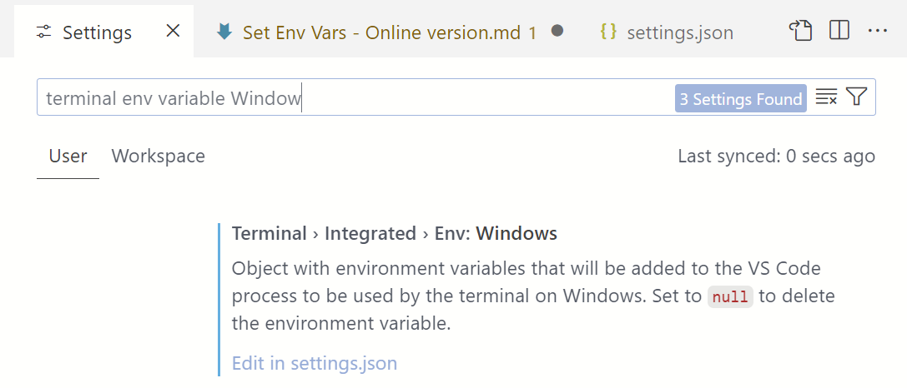
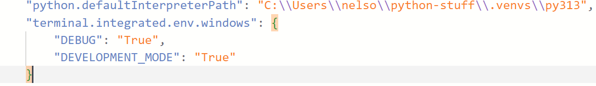

#   Set Env Variables For VS Code Terminal Window

1.  Select File -> Preferences --> Settings
1.  Press Ctrl+f to open the Find (search) bar
1.  Enter "terminal env variable Window" in the search bar. If you type slowly, it should start listing suggestions as you type. Press Enter key after entering the search target

1.  Click on the "Edit in settings.json" link to jump to the terminal settings. A window will open and position the cursor to where you should enter the DEBUG and DEVELOPMENT_MODE variables as shown below, inside the curly braces. It automatically saves you changes.

**IMPORTANT** VS Code wants these added items individually enclosed in **DOUBLE QUOTES.** It will be unhappy if you use the python-common single quotes and may not set the env variables as desired.

After making these changes, restart VS Code. Now when you open a new terminal window, it will have these values automatically set. I never remember how to display env vars so here is what I do to see their values, in either PowerShell or CMD window

    PowerShell window: $env:DEBUG
    CMD window: set DEVELOPMENT_MODE