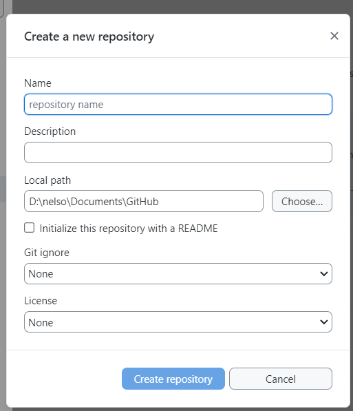
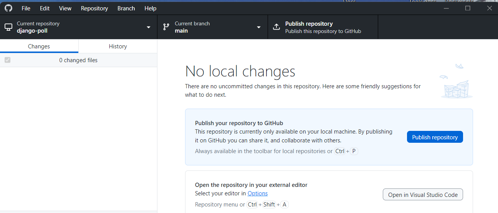

# Deploying Django onto Digital Ocean App from Win 11 - UNFINISHED

This whole Django web server deployment is a convoluted process and you have to 'hold your tongue in just the right spot' to have it work. And once it's up there, it seems to be fairly robust and automatically rebuilds whenever the GitHub repo is modified.

## Beginning a New GitHub Django D.O. project
I have been having trouble using git CLI, between GitHub PATs and SSH keys and all that jazz so I have started using GitHub Desktop. GitHub Desktop is quite robust and comprehensive in its coverage of git command but is kind of stubborn in its own right. 

### GH Desktop
1.  Start GitHub Desktop (install it as required)
1.  From the "Current repository" dropdown, click the Add button and then select the "Create new repository" option.

1.  Fill in the fields as desired. Be sure that the new name doesn't match an existing folder or it will stop and complain.
1.  Back on the main screen a new option is displayed to publish your repository. Go ahead and do it now because it simplifies things later.

1.  It will hiccup a few times and then it will go back to normal display. You can minimize this app for a while.

### PowerShell terminal window
Follow the instructions in [How to Deploy Django to Digital Ocean](https://www.digitalocean.com/community/tutorials/how-to-deploy-django-to-app-platform)Step 1 to create a virtual python environment. Note that the tilde "~" represents your user's home directory and Win 11 PowerShell repects the ~.

**IMPORTANT** Activate the virtual env in Windows as follows:

```
~\.venvs\django\Scripts\Activate.ps1
```

At the end of Step 1, you will generate a requirements.txt file. This file is required by DigitalOcean when you try to deploy your app. Be sure you run `pip freeze ...` in the virtual environment because if you do it in your non-virtual environment it will pick up every item you have ever pip installed and will produce an extremely bloated deployment.

Now follow the instruction in [Django Tutorial01](https://docs.djangoproject.com/en/5.1/intro/tutorial01/) in the Creating the Polls app
