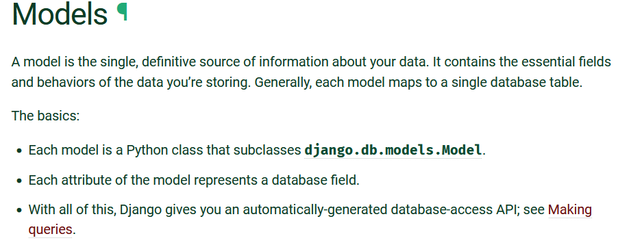
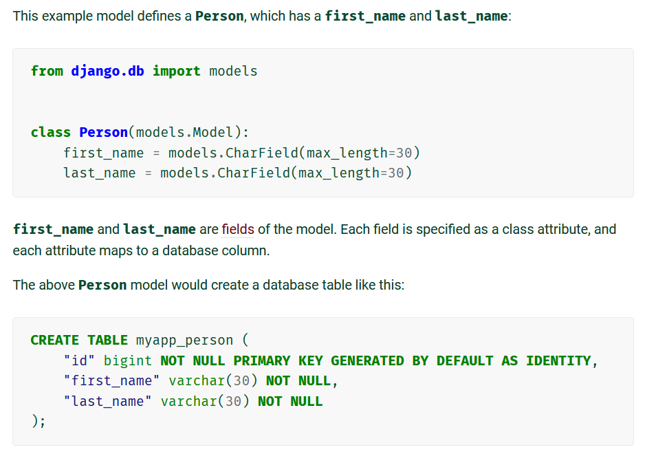
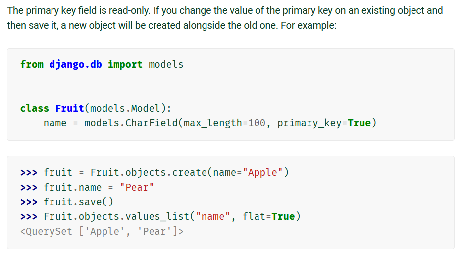
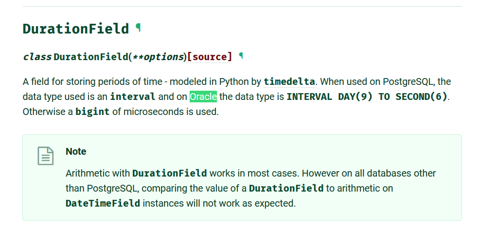
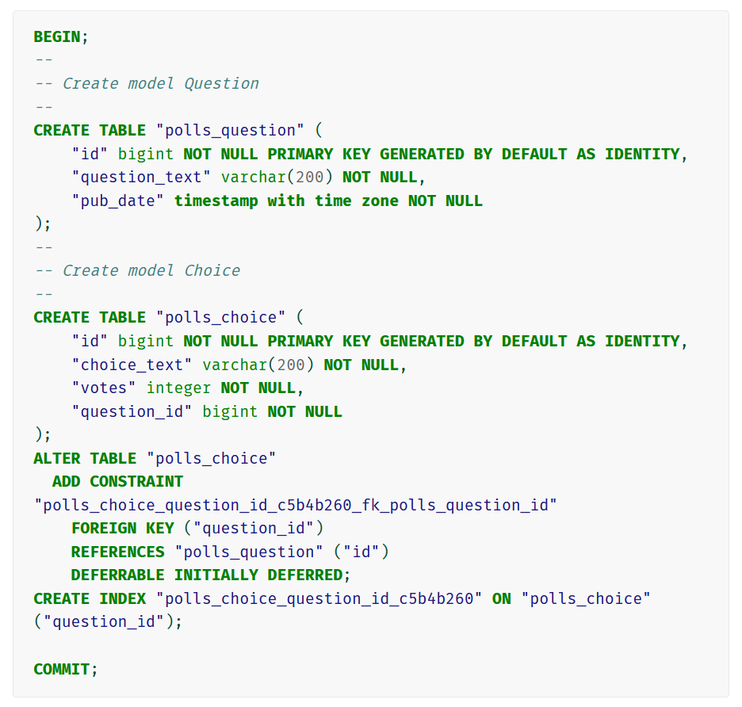

# Django Models and Fields Summary

### Short Description

Django uses Object Relational Mapping (ORM) to manage database info.

Every model must contain one or more attributes and each attribute represents an individual database field.

**IMPORTANT** Django automatically generates the "id" field if you don't specify a primary key field.

If you do designate your own primary key, beware of this behavior that duplicates records:

Django manages (hides) the differences between different database systems. The following screenshot shows how the Django DurationField is implemented in PostgreSQL, Oracle, and other dbms. The note further notes the limitations of trying to compare the value of a DurationField.

### Updating Models

After making changes to your model(s), enter the following commands:

    python manage.py makemigrations <folderName>
    python manage.py migrate

The first command applies only to a single folder subtree, for example: polls or timekeeping or scheduling. If you changed models in multiple folders, the second command will migrate (implement) all of the changes from all folders.

The first command generates a series of SQL commands that will resemble the following:

**IMPORTANT** The above migration commands are PostgreSQL specific. If a different dbms is used then the appropriate SQL commands are given.