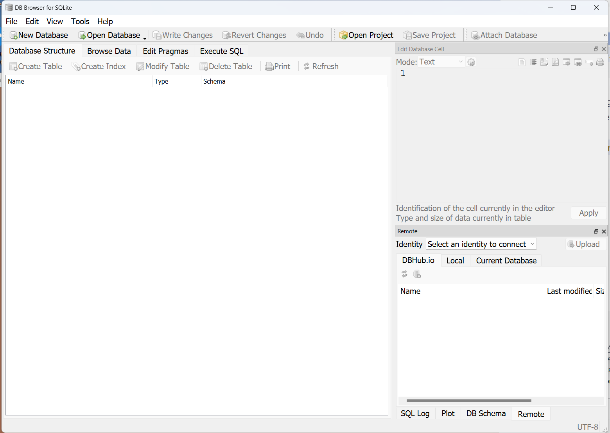

SQLite3 is a fast lightweight dbms that works great as a local database during development. And once the project is deployed onto a server, a different dbms (MySQL, PostgreSQL, etc) can be selected for doing the heavy lifting in production.

If you do select SQLite3 dbms for your local dev db, the DB Browser for SQLite is recommended. It is open source and does most (if not all) of the things that MySQL Workbench does.

Download it from:
    https://sqlitebrowser.org/dl/

Their description of it is "DB Browser for SQLite (DB4S) is a high quality, visual, open source tool designed for people who want to create, search, and edit SQLite or SQLCipher database files."

Once it is installed (I used the Standard installer for 64-bit Windows), start it running and it will look about like this:

Click on Open a Database File and navigate to your local copy of the bpmc repository and open the db.sqlite3 file

The db.sqlite3 file opens and shows a list of tables contained in that database. I clicked on the two tables that currently exist in the bpmc project to show their structures.

Click on the Scheduling_employee line and then click on the Browse Data tab. It will display the **local** data, which in this case is empty so the screen is blank.

If you want to insert some data into your local database, do the following:

1.  Select the desired table, such as scheduling_employee (it defaults to the first system table, not a user-created table). 
1.  Click on the icon/button for Insert New Record, next to the printer icon.

**IMPORTANT:** Hit the Enter key at the end of each row of data that you enter or it will complain with a confusing message. Just hit enter and it won't complain.

Click on the Execute SQL tab and enter your desired command and then click on the blue forward triangle button to execute the command. It will display the results, similar to the following:

You can click on the Write Changes button if you want to save the data locally or click the Revert Changes button if you want to discard the changes you made since the last time you saved.